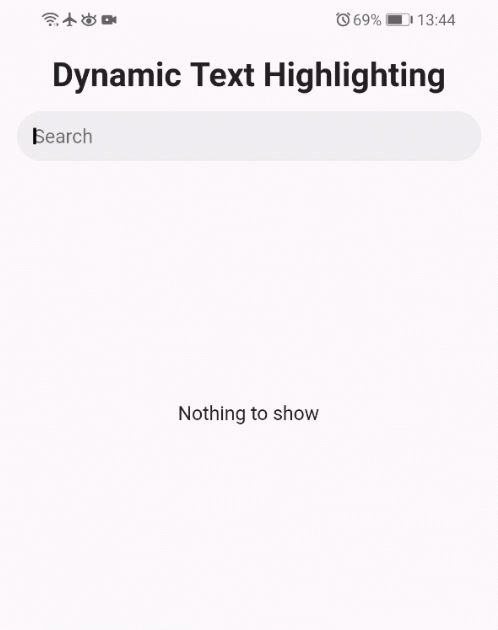

# Dynamic Text Highlighting (DTH)

This package is used to highlight, in a completely dynamic way, 
keywords, or phrases, wherever they are present in a specified text.



## Getting Started

DynamicTextHighlighting is also the name of the package widget. 
It returns a RichText widget and it accepts four basic parameters:

* `text`: the whole text
* `highlights`: the words to be highlighted
* `color`: the highlight color
* `style`: the default text style
* `caseSensitive`: the case sensitive option

In addition to these parameters, there are others related to
RichText widget:

* `TextAlign` textAlign
* `TextDirection` textDirection
* `bool` softWrap
* `TextOverflow` overflow
* `double` textScaleFactor
* `int` maxLines
* `Locale` locale
* `StrutStyle` strutStyle
* `TextWidthBasis` textWidthBasis
* `TextHeightBehavior` textHeightBehavior

### Example

```dart
Widget buildDTH(String text, List<String> highlights) {
  return DynamicTextHighlighting(
    text: text,
    highlights: highlights,
    color: Colors.yellow,
    style: TextStyle(
      fontSize: 18.0,
      fontStyle: FontStyle.italic,
    ),
    caseSensitive: false,
  );
}
```

It is a stateless widget, so for any changes
just call `setState(() {...})`.

```dart
void applyChanges(List<String> newHighlights) {
  setState(() {
    highlights = newHighlights;
  });
}
```
